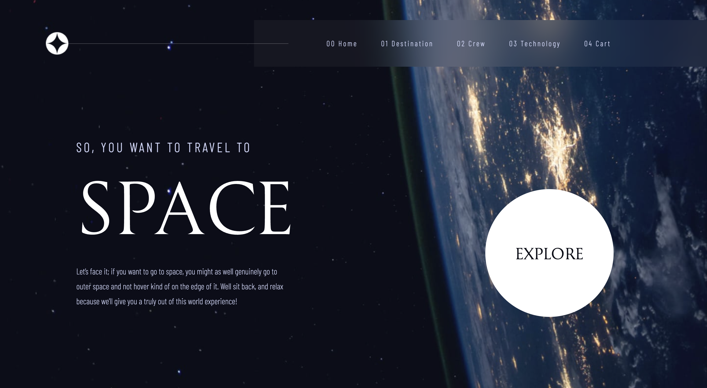

# Frontend Mentor - Space tourism website solution

This is a solution to the [Space tourism website challenge on Frontend Mentor](https://www.frontendmentor.io/challenges/space-tourism-multipage-website-gRWj1URZ3). Frontend Mentor challenges help you improve your coding skills by building realistic projects. 

## Overview

### The challenge

Users should be able to:

- View the optimal layout for each of the website's pages depending on their device's screen size
- See hover states for all interactive elements on the page
- View each page and be able to toggle between the tabs to see new information

### Screenshot

### Links

- Solution URL: [Add solution URL here](https://your-solution-url.com)
- Live Site URL: [Add live site URL here](https://travel-in-space-react.netlify.app/)

## My process

### Built with

- Semantic HTML5 markup
- CSS custom properties
- Flexbox
- [React](https://reactjs.org/)
- [Redux Toolkit](https://redux-toolkit.js.org/)
- [React Router](https://reactrouter.com/)

### What I learned

I have learned how to work with sliders in React, practiced adding items to a shopping cart, changing the quantity of items in the cart, and removing items from the cart. Additionally, I have practiced creating components in React, navigating between components using React Router and useNavigate, and using data files.

### Useful resources

- [Redux Toolkit Quick Start](https://redux-toolkit.js.org/introduction/getting-started) - This helped me to know how to set up and use Redux Toolkit with React-Redux.

## Author

- Website - [Valeriia Isaienko](https://valeriia-code.com)
- Frontend Mentor - [@Magic1vy](https://www.frontendmentor.io/profile/Magic1vy)
- LinkedIn - [Valeriia Isaienko](https://www.linkedin.com/in/valeriia-code)

